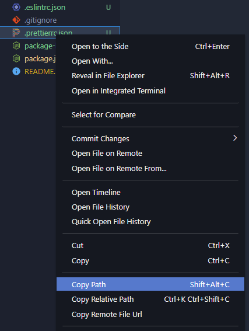
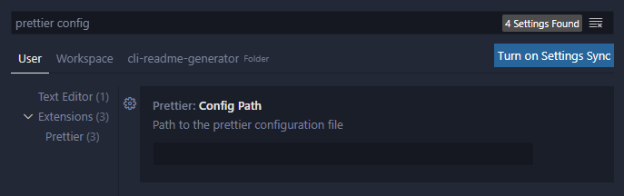
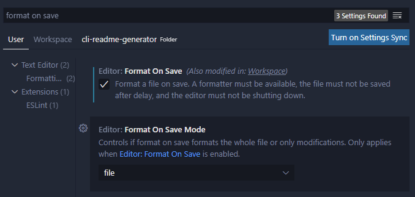

# General Purpose Node Template

This template provides a good starting point for any Node.js application.

## Pre-Requisites

Before attempting to set up the project for the first time, ensure that you have successfully installed the following utilities. If not, install them in the following order:

- [ ] [NodeJS](https://nodejs.org/en/) - **[Install NodeJS here](https://nodejs.org/en/)** for all operating systems.

- [ ] [npx](https://www.npmjs.com/package/npx) - Install **npx** with the following command:

```bash
npm install -g npx
```

## First Time Setup

### 1) Run the `setup` command

**In a terminal with this project as the current working directory, run the following command:**

```bash
npm run setup
```

### 2) Set the `Prettier` config file location

**In the vscode explorer window, right-click the `.prettierrc.json` file and copy its file path.**



**Then, press `Ctrl/⌘` + `,` to open vscode settings, then paste in the value for the _Prettier Config Path_ value.**



### 3) Enable the _Format on Save_ setting for Prettier



## Running the application

Run `npm start` to launch a [nodemon](https://github.com/remy/nodemon) session which will run your app and watch for changes with hot reloading. The entrypoint for nodemon is `src/index.js`.

## Git Commits

This project template uses [Husky](https://github.com/typicode/husky) to run a pre-commit hook before you commit. This helps prevent bad code from polluting the repository. It runs ESLint and Prettier; if either of those fail, the commit is aborted. Feel free to add automated testing to this pre-commit hook as well!
